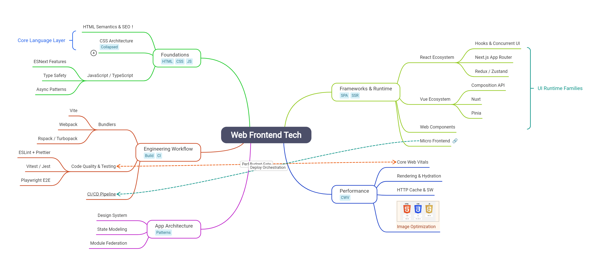

# Mind Map Flutter

一个用于 Flutter 的思维导图库，支持交互编辑、主题定制、历史记录与多格式导出。

语言: [English](README.md) | **简体中文**

## 功能概览

- 可编辑节点树，支持拖拽重组
- 节点样式定制：文字、背景、字体、标签、图标、链接、图片
- 支持箭头与摘要（Summary）
- 撤销/重做与复制/粘贴
- 聚焦模式、缩放/平移、居中与自适应视图
- JSON / PNG 导出
- 内置明暗主题，支持自定义主题
- 内置文案支持 `MindMapLocale.auto/zh/en`
- 支持 Android、iOS、Web、Windows、macOS、Linux

## 安装

```yaml
dependencies:
  mind_map_flutter: <latest-version>
```

```bash
flutter pub get
```

## 快速开始

```dart
import 'package:flutter/material.dart';
import 'package:mind_map_flutter/mind_map_flutter.dart';

void main() {
  runApp(const MaterialApp(home: MindMapPage()));
}

class MindMapPage extends StatelessWidget {
  const MindMapPage({super.key});

  @override
  Widget build(BuildContext context) {
    return Scaffold(
      appBar: AppBar(title: const Text('Mind Map')),
      body: MindMapWidget(
        initialData: MindMapData(
          nodeData: NodeData.create(
            topic: '中心主题',
            children: [
              NodeData.create(topic: '分支 A'),
              NodeData.create(topic: '分支 B'),
            ],
          ),
          theme: MindMapTheme.light,
        ),
      ),
    );
  }
}
```

## Controller 用法

```dart
late final MindMapController controller;

@override
void initState() {
  super.initState();
  controller = MindMapController(
    initialData: MindMapData(
      nodeData: NodeData.create(topic: '项目规划'),
      theme: MindMapTheme.light,
    ),
    config: const MindMapConfig(
      allowUndo: true,
      enableKeyboardShortcuts: true,
      enableContextMenu: true,
      enableDragDrop: true,
      minScale: 0.1,
      maxScale: 5.0,
      maxHistorySize: 50,
      locale: MindMapLocale.auto,
    ),
  );

  controller.eventStream.listen((event) {
    if (event is FinishEditEvent) {
      debugPrint('已编辑: ${event.nodeId} -> ${event.newTopic}');
    }
  });
}
```

## 更多示例

### 新增并更新节点

```dart
final rootId = controller.getData().nodeData.id;

controller.addChildNode(rootId, topic: '待办');
final newNodeId = controller.getSelectedNodeIds().first;

controller.updateNodeTopic(newNodeId, '本周计划');
controller.addSiblingNode(newNodeId, topic: '下周计划');
controller.centerOnNode(newNodeId);
```

### 导出 JSON 与 PNG

```dart
import 'dart:io';

final jsonText = controller.exportToJson();
await File('mind_map.json').writeAsString(jsonText);

final pngBytes = await controller.exportToPng(pixelRatio: 2.0);
await File('mind_map.png').writeAsBytes(pngBytes);
```

说明：`exportToPng()` 需要在 `MindMapWidget` 完成挂载并绘制后调用。

## 致谢

本项目完全由 AI 协助编写。

特别感谢：

- Codex
- Kiro
- Claude Code
- Mind Elixir
